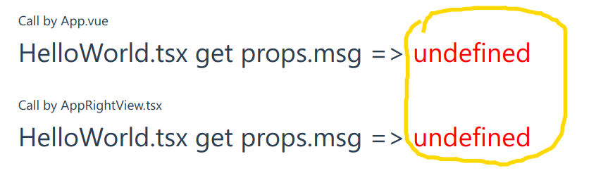

# vue-issues-project

# Step

```bash
pnpm i
pnpm dev
```

# Error



`HelloWorld` Component:
```typescript
export interface HelloWorldProps {
  msg: string;
}

export default defineComponent<HelloWorldProps>((props) => {
  const msg = ref(props.msg);
  if (!props.msg) {
    console.error(
      `Can not get props from defineComponent function in tsx file: props.msg=${props.msg}`
    );
  }
  return () => (
    <div>
      <h1>
        HelloWorld.tsx get props.msg {" => "}
        <span style="color:red;">{props.msg ?? msg.value ?? "undefined"}</span>
      </h1>
    </div>
  );
});
```
